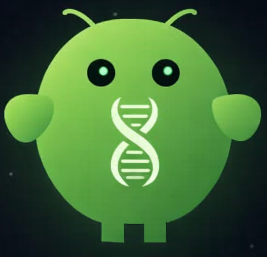
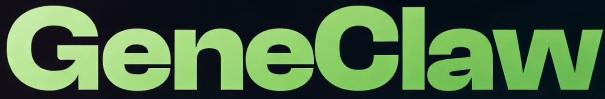

<p align="center">
  
</p>

<h1 align="center">GeneClaw</h1>

<p align="center">
  
</p>

<p align="center">
  <strong>Multimodal agent demo</strong> — genetic report context, voice concierge, and Telegram-based longitudinal symptom follow-up (non-diagnostic).
</p>

---

## Hackathon submission overview

GeneClaw ties together five integration tracks:

| Track | What it does |
|-------|----------------|
| **[Geno Health Portal](https://github.com/negarl/geno-health-portal)** | Companion project where we implemented the **first crawl** of the target genetics / health reporting websites. **Source:** [github.com/negarl/geno-health-portal](https://github.com/negarl/geno-health-portal). **GeneClaw talks to this site** (demo portal + credentials flow); see below. |
| **[Lovable](https://lovable.dev/)** | UI and full-stack scaffolding (Vite, React, shadcn/ui), Git sync, and the hosted **Telegram connector** used by our Edge Function. |
| **[Maritime](https://maritime.sh/docs) + OpenClaw** | Long-running **OpenClaw** agent with repo-backed **skills**, **cron**-driven round reminders, and operator visibility in the Maritime dashboard. Assets live in [`openclaw/`](openclaw/README.md). |
| **[ElevenLabs](https://elevenlabs.io/)** | **Conversational AI** voice session (WebRTC) with an animated in-app “orb” agent. |
| **Telegram** | Public bot entry point (`@geneclaw_vienna_bot`) and messaging via **Supabase Edge Functions** + Lovable’s gateway. |

**Important:** This project is a **demo**. It is **not** medical advice, not a diagnostic tool, and not a substitute for professional care or emergency services.

---

## Geno Health Portal and first crawl

- **Crawl implementation** lives in a separate repository: **[negarl/geno-health-portal](https://github.com/negarl/geno-health-portal)**. That project covers the **initial crawl** of the websites we target for genetics / health report flows.
- **GeneClaw integrates with that portal:** end users sign in against the demo site (see the in-app and Telegram links to `geno-health-portal.lovable.app` and demo credentials). The broader multimodal agent story (voice + Telegram + OpenClaw onboarding) assumes report pages and auth context from that stack.

---

## Features

- **Dashboard** — Genetic-health style home, reports/symptoms panels, deep link to the **[Geno Health Portal](https://github.com/negarl/geno-health-portal)**–backed demo (`geno-health-portal.lovable.app`; see in-app Telegram card).
- **Voice (ElevenLabs)** — Start/stop conversation with the bundled ElevenLabs React SDK; microphone permission required.
- **Telegram** — In-app CTA opens the Vienna bot; backend uses `telegram-chat` function for `send` / `getUpdates` patterns.
- **OpenClaw / Maritime** — Markdown skills (`openclaw/skills/…`) describe the symptom follow-up workflow; scheduled runs update per-user JSON under `data/symptom-users/` and appear in Maritime-style run logs (see [`openclaw/README.md`](openclaw/README.md)).

---

## Tech stack

- **Companion (crawl / portal):** [Geno Health Portal](https://github.com/negarl/geno-health-portal) (not in this repo; GeneClaw consumes the live portal)  
- **Frontend:** React 18, TypeScript, Vite 5, Tailwind CSS, shadcn/ui, Framer Motion  
- **Backend:** Supabase (client + Edge Functions on Deno)  
- **Voice:** `@elevenlabs/react` (`ConversationProvider` in `src/App.tsx`)  
- **Lovable dev:** `lovable-tagger` (development mode only, see `vite.config.ts`)

---

## Prerequisites

- **Node.js** 18+ (or **Bun**, if you use the lockfile that way)
- **Supabase** project linked to this app (URL + anon key)
- **Lovable** project access if you deploy or edit via Lovable
- **Optional:** ElevenLabs account and published conversational agent; **optional:** Maritime deployment for OpenClaw

---

## Local setup

```bash
git clone <your-fork-or-repo-url>
cd geneclaw
npm install
```

Create a **`.env`** file in the project root (do not commit secrets):

| Variable | Used for |
|----------|-----------|
| `VITE_SUPABASE_URL` | Supabase project URL |
| `VITE_SUPABASE_PUBLISHABLE_KEY` | Supabase anon / publishable key |

Start the dev server (default in this repo: **port 8080**):

```bash
npm run dev
```

Other scripts:

| Command | Purpose |
|---------|---------|
| `npm run build` | Production build |
| `npm run preview` | Preview production build |
| `npm run lint` | ESLint |
| `npm test` | Vitest |

---

## Lovable

- The app is built and iterated in **[Lovable](https://lovable.dev/)** — sync your repo, open the project in Lovable to edit visually, and publish as you normally would for a Lovable-hosted app.
- In **development**, `lovable-tagger` attaches to Vite for component tagging (see `vite.config.ts`).
- **Telegram sending** from the Edge Function uses Lovable’s **connector gateway** (`connector-gateway.lovable.dev`) with your **Lovable API key** (see Telegram section).

---

## OpenClaw agent on Maritime

- **[Maritime documentation](https://maritime.sh/docs)** covers deploying and operating agents (workspaces, runs, scheduling, and dashboard visibility).
- In this repo, **skill definitions and operator notes** are under **[`openclaw/`](openclaw/README.md)** (including **cron reminder** behavior and an example **dashboard log** for a Round 2 follow-up).
- Typical flow: attach the Git-backed **OpenClaw workspace** on Maritime, ensure skills from `openclaw/skills/` are on the workspace path your agent loads, and use **cron** (or Maritime’s scheduler) so users receive the next screening round without messaging first.

For copy-paste into Cursor as a project skill:

```bash
mkdir -p .cursor/skills
cp -r openclaw/skills/telegram-symptom-followup .cursor/skills/
```

---

## ElevenLabs (voice avatar / agent)

- The voice UI lives in **`src/components/VoiceAgent.tsx`**, wrapped by **`ConversationProvider`** in **`src/App.tsx`**.
- The **agent ID** is currently set in code as `AGENT_ID` (ElevenLabs **Conversational AI** agent). Replace it with your own agent ID from the [ElevenLabs dashboard](https://elevenlabs.io/) when forking.
- Uses **WebRTC** (`connectionType: "webrtc"`). The browser will prompt for **microphone** permission on first connect.
- For hackathon/demo polish, configure your ElevenLabs agent’s **voice**, **system prompt**, and any **knowledge** there; the app focuses on the session UX (orb, connect/disconnect).

---

## Telegram integration

**In-app**

- The Telegram panel links to **`https://t.me/geneclaw_vienna_bot`** (`src/components/TelegramChat.tsx`). Update this constant if you register a new bot.

**Backend (`supabase/functions/telegram-chat`)**

- **`LOVABLE_API_KEY`** — Bearer token for Lovable APIs (set as a Supabase Edge Function secret).
- **`TELEGRAM_API_KEY`** — Passed as `X-Connection-Api-Key` to the Lovable Telegram connector (set as a secret).
- Supported JSON **`action`** values: **`send`** (requires `chatId`, `text`) and **`getUpdates`** (long-poll style helper).

Secrets are configured in the **Supabase dashboard** (or CLI) for the deployed function — never commit them to git.

---

## Repo layout (quick reference)

| Path | Notes |
|------|--------|
| `src/pages/Index.tsx` | Main dashboard |
| `src/components/VoiceAgent.tsx` | ElevenLabs voice session |
| `src/components/TelegramChat.tsx` | Telegram deep link + demo portal hints |
| `supabase/functions/telegram-chat/` | Telegram proxy via Lovable gateway |
| `openclaw/skills/` | OpenClaw / agent **SKILL.md** + references |

---

## License / credits

This project is licensed under the **MIT License** — see [`LICENSE`](LICENSE).

Built as a **hackathon submission**. Companion **crawl + portal** work: [github.com/negarl/geno-health-portal](https://github.com/negarl/geno-health-portal). Stack credits: Lovable, Supabase, ElevenLabs, Maritime/OpenClaw ecosystem as described above.
